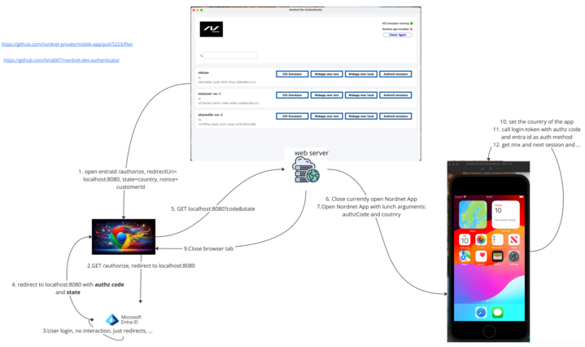

# Nordnet dev authenticator

Use this application to easily log into Nordnet non prod environments: 
 - Test environment of the mobile app in iOS simulator 
 - Test environment of the mobile app in Android emulator (TODO)
 - Test environment of the web app next (nordnet-test.xy)
 - Local environment of the web app next (nordnet-local.xy:8081)
 - Staging environment(s) of the web app next (https://*.webapp-next.staging.nordnet-test.xy)

## Requirements for running
 - Java 17 (or higher)
   - Make sure JAVA_HOME env variable is set and jdk/bin is in the PATH env variable
 - jq (brew install jq)

## List of test users:
  List of customer (ids) that can be used for login exists as [properties](src/main/resources/application.yml) of this application.
  If you want to log in as other (test env) customers, just add them as properties and rerun the application.
        
* (Recommended) Create a PR for the new users you add to the list, so that other developers can use them too. 
  * The name field is just a way to call each customer (id). They are not referencing to anything like username or ... .

## How to run the application (on MacOS and Linux)
    - Clone the repository locally
    - `cd` to the repository root
    - Make sure you are logged in to gcp (gcloud auth login --update-adc)
    - Run `./gradlew bootRun` to start the application
    - `git pull` every now and again to get the latest features and customer(ids)

### Desktop shortcut:
    - `cd` to the project/repository root (important)
    - Run `./desktop-shortcut.sh`
    
    * To use the desktop shortcut, make sure you are logged in to gcp (gcloud auth login --update-adc)
        * The desktop shortcut is just to shortcut the command `./gradlew bootRun` which builds and runs the application. 
### Note
    - On the mobile app repo (link todo), run the command `npm run env dev` on the lastest version of master before installing the app on simulator.
    - When you want to login as a new user in the app simulator, you need to logout manually first. Otherwise you will be kept logged in as the last user.

## TODO
    - App Icon
    - Desktop shortcut icon
    - Add support for Android emulator
    - Automatically build the latest version of the app in github and send releases to company portal!

### Architecture:

